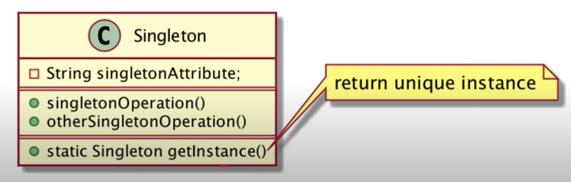

# Singleton
### Pengertian
- GOF : Ensure a class only has one instance, and provide a global point of access to it.
- Memastikan bahwa sebuah class hanya memiliki satu instance object, dan menyediakan cara mengaksesnya secara global (artinya bisa diakses dari mana saja)

### Motivasi
- Pada beberapa kasus, memastikan sebuah class hanya memiliki satu instance object sangat penting
- Pertanyaannya, bagaimana memastikan sebuah class hanya memiliki satu instance object?
- Solusinya adalah membiarkan class itu sendiri yang bertanggungjawab untuk instance objectnya sendiri. Class tersebut bisa memastikan tidak ada instance lain yang dibuat, dan akan menyediakan cara mengakses singleton object tersebut.
- Ketika terdapat perubahan pada instance object, client yang menggunakan singleton object tersebut tidak perlu melakukan perubahan

### Struktur


### Keuntungan
- Class singleton bisa mengatur bagaimana dan kapan client bisa mengakses object singleton tersebut
- Singleton lebih aman dibandingkan global variable. Ini mencegah client secara tidak sengaja mengubah global variable
- Class singleton bisa mengubah implementasi dari instance objectnya, tanpa harus melakukan perubahan di client yang mengaksesnya

### Singleton Pattern di Spring Boot
- Implementasi singleton pattern di Spring sangatlah mudah, kita bahkan tidak perlu membuat class khusus singleton
- Secara default object bean yang terdapat di Spring sudah singleton, jadi secara tidak sadar sebenarnya kita sudah mengimplementasikan singleton pattern

### Kapan Menggunakan Singleton Pattern
- Saat menggunakan Spring, sebisa mungkin selalu menggunakan singleton patter, kecuali memang ada kebutuhan khusus sehingga kita tidak ingin menggunakan singleton
- Secara default, Spring selalu membuat object secara singleton, dan secara default object akan dibuat secara eager (langsung di awal ketika aplikasi dijalankan), namun jika kita ingin membuat object singleton ketika object akan diakses, kita bisa mengubahnya menjadi lazy (artinya hanya dibuat ketika pertama kali diakses)
- Namun jika objectnya berat, seperti koneksi database, membuat http client, dan lain-lain, sangat disarankan membuat object singleton yang eager

### Contoh Kasus
- Kita akan membuat sebuah Counter sebagai berapa banyak request yang sudah ditangani oleh aplikasi kita
- Kita akan membuat class Counter, dimana class Counter ini akan menyimpan data jumlah counter, dan memiliki method untuk menaikkan data counternya
- Kita akan membuat instance class Counter sebagai singleton object, karena data counter harus selalu sama, sehingga tidak memerlukan lebih dari satu instance object

### Kode: Class Counter
```java
public class Counter {
    private Long value = 0L;
    
    public Long getValue() { return value; }
    
    public void increment() {
        value++;
    }
}
```

### Kode: Membuat singleton
```java
@Bean
public Counter counter() {
    return new Counter();
}
```

### Kode: Test Singleton
```java
Counter counter1 = applicationContext.getBean(Counter.class);
Counter counter2 = applicationContext.getBean(Counter.class);
Counter counter3 = applicationContext.getBean(Counter.class);

counter1.increment();
counter2.increment();
counter3.increment();

System.out.println(counter1.getValue());
System.out.println(counter2.getValue());
System.out.println(counter3.getValue());
```

### Yang Perlu Diperhatikan
- Singleton object secara otomatis akan disharing ke semua client
- Oleh karena itu pastikan singleton object itu immutable (tidak bisa diubah)
- Jika singleton object nya bersifat mutable (bisa diubah), pastika tidak terjadi race condition ketika diubah secara bersamaan oleh beberapa client secara sekaligus

### Kode contoh kejadian Race Condition
```java
private void incrementCounterAsync(Counter, int total) {
    new Thread(() -> {
        for (int i = 0; i < total; i++) {
            counter.increment();
        }    
    }).start();
}
```

### Kode test Race Condition
```java
Counter counter1 = applicationContext.getBean(Counter.class);
Counter counter2 = applicationContext.getBean(Counter.class);

incrementCounterAsync(counter1, 1000000);
incrementCounterAsync(counter2, 1000000);

Thread.sleep(5000L);
System.out.println(counter1.getValue());
System.out.println(counter1.getValue());
```

### Cara mengatasi Race Condition
```java
public class Counter {
    
    ...
    
    public synchronized void increment() {
        value++;
    }
}
```
Dengan cara menambahkan synchronized pada method yang diakses. Hal ini sama artinya dengan class Counter ketika ada beberapa thread mengakses method increment, maka method increment() hanya dijalankan 1 saja dan yang lainnya menunggu (efek sampingnya program jadi lambat tapi lebih aman)