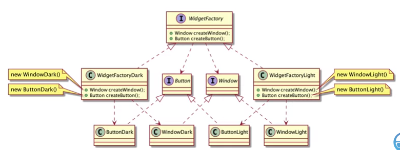

 # Factory Method Pattern
 
### Pengertian
- GOF : Define an interface for creating an object, but let subclasses decide which class to instantiate. Factory Method lets a class defer instantiation to subclasses.
- Membuat interface untuk membuat object, tetapi biarkan subclass memutuskan kelas mana yang akan dibuat. Factory Method memungkinkan instansiasi class dilakukan ke subclassnya
- Biasa disebut sebagai Virtual Constructor

### Motivasi
- Biasanya library atau framework yang baik, selalu menggunakan abstract class atau interface untuk menjaga relasi antar object, bahkan kadang library atau framework bertanggunjawab membuat objectnya
- Factory Method merupakan pattern dimana kita bisa membuat object dari abstract class atau interface dengan cara menggunakan abstract class atau interface factory
- Dimana implementasi factory tersebut bisa menentukan class mana yang digunakan untuk membuat object tersebut
- Biasanya implementasi factory object dibuat dengan singleton pattern

### Struktur Factory Method


### Struktur Factory Method dengan Inheritance


### Keuntungan
- Factory Method mengeliminasi ketergantungan antara client dengan class yang spesifik, karena client hanya butuh berinteraksi dengan Product interfacenya
- Membuat object dengan menggunakan factory method sangat flexible dibandingkan harus membuat object secara langsung
- Perubahan atau pergantian class konkrit pada Factory tidak perlu dirisaukan oleh client, karena client hanya berinteraksi dengan Product interfacenya
- Potensi kerugian Factory Method hanya kita perlu membuat factory class untuk setiap implementasi class dari Product Interface

### Factory Method Pattern di Spring Boot
- Untuk implementasi Factory Method di Spring, kita tidak perlu bersusah-susah membuat Factory classnya
- Kita bisa memanfaatkan Spring Application Context sebagai Factory classnya
- Dengan begitu, kita cukup fokus membuat Bean yang digunakan sebagai Factory Methodnya
- Khusus untuk Factory Method, kita perlu membuat menggunakan prototype pattern, karena jika menggunakan Singleton pattern, Bean akan secara otomatis dibuat sekali diawal

### Kapan Menggunakan Factory Method Pattern
- Ketika kita butuh membuat object dari interface, namun tidak perlu peduli dengan implementasi concrete classnya
- Ketika object dari interface, bisa diubah-ubah sesuai parameter yang kita berikan pada factory method

### Contoh Kasus
- Aplikasi kita membutuhkan data Sosial Media, namun kita tidak terlalu peduli dengan implementasi detail sosial medianya
- Factory Method bisa menentukan implementasi detail object sosial media sesuai dengan tipe kita berikan

### Kode : Interface Social Media
```java
public interface SocialMedia {
    String getName();
    String getUrl();
    SocialMediaType getType();
}
```

### Kode : Factory Method
```java
@Bean
@Scope("prototype")
public SocialMedia socialMedia(SocialMediaType type) {
    if (type == SocialMediaType.FACEBOOK) {
        return FacebookSocialMedia.builder()
            .name("FACEBOOK")
            .url("https://www.facebook.com")
            .type(SocialMediaType.FACEBOOK)
            .build();
    } else if (type == SocialMediaType.TWITTER) {
        return TwitterSocialMedia.builder()
            .name("TWITTER")
            .url("https://www.twitter.com")
            .type(SocialMediaType.TWITTER)
            .build();
    } else {
        throw new RuntimeException("Unsupported Social Media Type");
    }
}
```

### Spring BeanFactory

- ApplicationContext adalah interface turunan dari BeanFactory
- BeanFactory ada implementasi factory method pattern
- Oleh karena itu, jika menggunakan Spring, kita tidak perlu lagi membuat Factory class lagi, karena semua sudah otomatis dibuat oleh Spring

### Kode : Menggunakan Factory Method
```java
SocialMedia facebook = applicationContext.getBean(SocialMedia.class, SocialMediaType.FACEBOOK);
SocialMedia twitter = applicationContext.getBean(SocialMedia.class, SocialMediaType.TWITTER);

System.out.println(facebook);
System.out.println(twitter);
```

### Factory Method dengan Inheritance
- Bagaimana implementasi Factory Method dengan Inheritance?
- Karena kita tidak perlu membuat Factory class lagi, pembuatan Factory Method dengan Inheritance mirip dengan Prototype Pattern
- Yang membedakan adalah, pada prototype, kita menyalin data dari object dengan class yang sama, sedangkan pada factory method, kita hanya peduli pada interfacenya, sedangkan class nya yang ditentukan oleh factory method itu sendiri

### Kode : Factory Method
```java
@Bean
@Scope("prototype")
public SocialMedia socialMediaFacebook() {
    return FacebookSocialMedia.builder()
        .name("FACEBOOK")
        .url("https://www.facebook.com")
        .type(SocialMediaType.FACEBOOK)
        .build();
}

@Bean
@Scope("prototype")
public SocialMedia socialMediaTwitter() {
    return TwitterSocialMedia.builder()
        .name("TWITTER")
        .url("https://www.twitter.com")
        .type(SocialMediaType.TWITTER)
        .build();
}
```

### Kode : Menggunakan Factory Method dengan Inheritance
```java
SocialMedia facebook = applicationContext.getBean("socialMediaFacebook", SocialMedia.class);
SocialMedia twitter = applicationContext.getBean("socialMediaTwitter", SocialMedia.class);

System.out.println(facebook);
System.out.println(twitter);
```